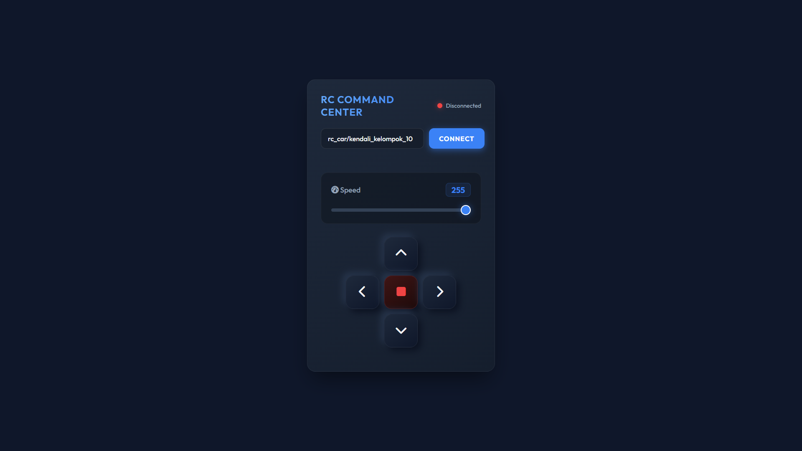

# IoT Router and Network Integration

## Tinjauan Integrasi Jaringan

Dokumentasi ini menguraikan secara komprehensif arsitektur integrasi jaringan antara perangkat Internet of Things (IoT) dengan infrastruktur router utama. Fokus utama dari repositori ini adalah pada pengelolaan konektivitas, validasi alamat MAC, serta konfigurasi Access Point (AP) dan Station (STA) pada perangkat mikrokontroler. Pendekatan ini memastikan perangkat IoT dapat berkomunikasi secara efisien dan aman dalam jaringan lokal sebelum melakukan transmisi data ke peladen eksternal atau layanan cloud.

## Komponen Jaringan dan Fungsionalitas Utama

Sistem memiliki beberapa modul utama yang secara spesifik menangani aspek jaringan:

### 1. Modul Pencatatan Alamat MAC (`02_getMacAdd`)
Modul ini bertugas untuk mengidentifikasi perangkat secara unik dalam jaringan. Proses identifikasi perangkat menggunakan alamat Media Access Control (MAC) yang tertanam pada perangkat keras. Langkah ini esensial untuk keperluan pemfilteran akses di tingkat router (MAC filtering) dan alokasi IP statis (DHCP reservation).

### 2. Modul Konfigurasi Mode Ganda AP dan STA (`03_APandSTA.ino`)
Perangkat beroperasi dalam topologi jaringan yang fleksibel menggunakan mode hibrida.
* **Mode Station (STA):** Perangkat menghubungkan diri ke router utama yang sudah ada untuk mendapatkan akses internet dan bertukar data dengan perangkat lain di jaringan yang sama.
* **Mode Access Point (AP):** Perangkat memancarkan sinyal Wi-Fi miliknya sendiri, menyediakan antarmuka lokal bagi pengguna untuk melakukan konfigurasi awal tanpa memerlukan koneksi ke infrastruktur jaringan luar.

### 3. Validasi dan Otentikasi Koneksi (`03_connectToRouterAndValidate`)
Modul ini mengimplementasikan protokol lapisan aplikasi untuk memverifikasi konektivitas yang berhasil ke router. Perangkat tidak hanya mencoba terhubung ke jaringan Wi-Fi, tetapi juga menjalankan prosedur jabat tangan (handshake) dan pertukaran paket data dasar untuk memastikan jalur komunikasi berjalan tanpa hambatan.

## Panduan Konfigurasi Jaringan Secara Mendetail

Langkah-langkah berikut menjelaskan prosedur konfigurasi jaringan untuk menghubungkan perangkat ke router secara optimal:

### A. Persiapan Konfigurasi Router Utama
1. Masuk ke halaman administrasi web router utama menggunakan alamat IP gerbang default (contoh: `192.168.1.1` atau `192.168.0.1`) melalui peramban web.
2. Navigasikan ke bagian pengaturan jaringan nirkabel (Wireless Settings) dan pastikan penyiaran SSID (Service Set Identifier) berstatus aktif.
3. Tetapkan protokol keamanan ke WPA2-PSK (AES) untuk memastikan enkripsi data yang tangguh terhadap potensi penyadapan jaringan.
4. Buka bagian kontrol akses (Access Control) atau pemfilteran MAC (MAC Filtering). Masukkan alamat MAC perangkat yang diperoleh dari modul `02_getMacAdd` ke dalam daftar putih (whitelist) untuk memberikan otorisasi akses penuh ke jaringan.
5. Konfigurasikan pemesanan DHCP (DHCP Reservation) dengan mengaitkan alamat MAC perangkat dengan alamat IP lokal statis (misalnya `192.168.1.50`). Hal ini mencegah konflik alamat IP dan mempermudah akses ke peladen web lokal yang berjalan pada mikrokontroler.

### B. Implementasi Koneksi pada Mikrokontroler
1. Buka kode sumber konfigurasi pada platform pengembangan yang relevan.
2. Sesuaikan parameter `const char* ssid` dengan nama jaringan Wi-Fi dari router utama.
3. Sesuaikan parameter `const char* password` dengan kata sandi dari jaringan Wi-Fi router utama.
4. Tentukan konfigurasi IP statis pada kode untuk menyesuaikan dengan pemesanan DHCP di router. Tentukan alamat IP lokal, alamat IP gerbang (gateway), dan alamat subnet mask secara eksplisit dalam kode (contoh: `IPAddress local_IP(192, 168, 1, 50);`, `IPAddress gateway(192, 168, 1, 1);`, `IPAddress subnet(255, 255, 255, 0);`).
5. Kompilasi dan unggah program ke perangkat.
6. Pantau proses negosiasi jaringan melalui monitor serial pada kecepatan 115200 baud. Pastikan perangkat mencetak status terhubung dan menampilkan alamat IP yang telah teralokasikan oleh router.

### C. Pengujian Integrasi dan Antarmuka Kontrol
1. Pastikan komputer atau perangkat bergerak yang digunakan berada pada jaringan lokal (LAN) yang sama dengan perangkat mikrokontroler.
2. Buka peramban web dan masukkan alamat IP lokal yang telah menerima konfigurasi pada perangkat (contoh: `http://192.168.1.50`).
3. Sistem akan menyajikan antarmuka kontrol web seperti yang tertera pada tangkapan layar di atas, yang menunjukkan integrasi jaringan telah berhasil beroperasi dan perangkat siap menerima perintah melalui protokol HTTP.